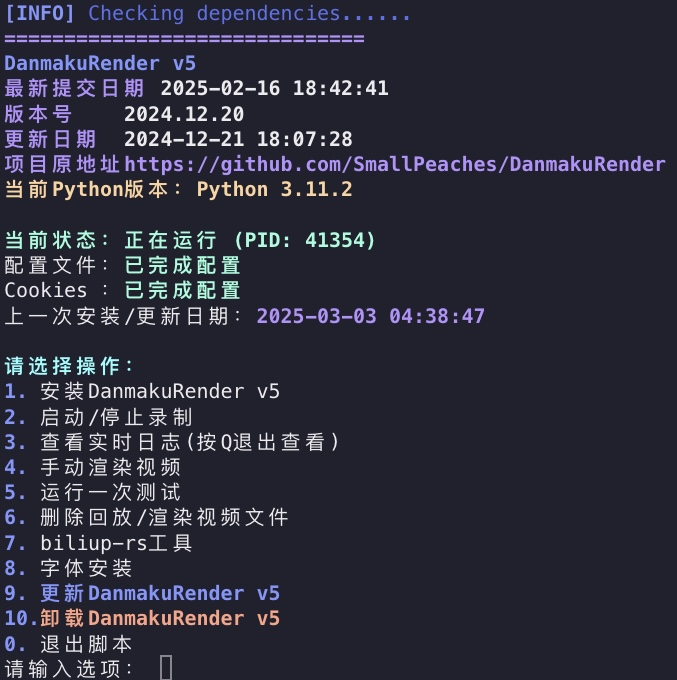

## 🦁Script
- 适用于**Debian/Ubuntu**
- 一键安装/卸载,启动/停止录制
- ~~其实Docker构建更方便~~
```bash
bash <(wget -qO- https://raw.githubusercontent.com/sillda76/DanmakuRender/refs/heads/v5/dmr.sh)
```

### 2025-03-20）
- 修正错误处理
- 删除主菜单 Cookies 显示
- 重构代码结构

##### [biliup-rs 项目地址](https://github.com/biliup/biliup-rs)

#### 以下为原项目的 README.md
---

# DanmakuRender-5 —— 一个录制带弹幕直播的小工具（版本5）
结合网络上的代码写的一个能录制带弹幕直播流的小工具，主要用来录制包含弹幕的视频流。     
- 可以录制纯净直播流和弹幕，并且支持在本地预览带弹幕直播流。
- 可以自动渲染弹幕到视频中，并且渲染速度快。
- 支持同时录制多个直播。    
- 支持录播自动上传至B站。     

此版本为全新设计的版本5，包含以下新功能：     
- 支持动态载入配置文件。
- 支持更加复杂的录制、上传、渲染和清理逻辑。
- 支持搬运直播回放或者视频。
- 支持使用webhook与其他录制软件协同（正在开发）。

旧版本可以在分支v1-v4找到。     


## 使用说明
**如果你是纯萌新建议看我B站的专栏安装：https://www.bilibili.com/read/cv26348023**         

### 安装与使用文档      
[**安装文档**](docs/installation.md)       
[**使用文档**](docs/usage.md)     

[**服务器录播示例**](https://github.com/SmallPeaches/DanmakuRender/discussions/368)

### 可选参数
程序运行时可以指定以下参数
- `--config` 指定配置文件夹，默认configs
- `--version` 查看版本号
- `--skip_update` 跳过版本检查

## 更多
感谢 THMonster/danmaku, wbt5/real-url, ForgQi/biliup, ForgQi/stream-gears 的工作。     
出现问题欢迎大家提issue讨论。       

**本程序仅供研究学习使用！**
